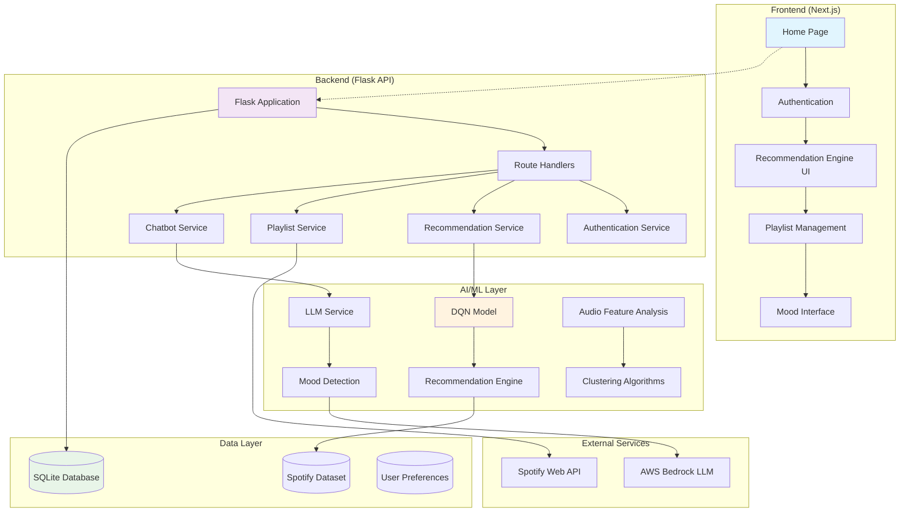
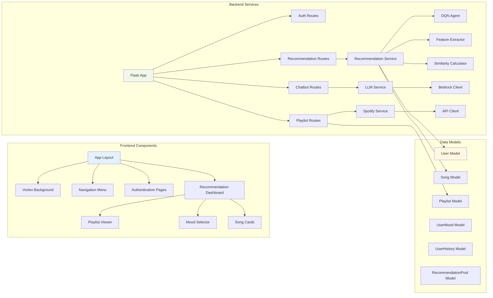
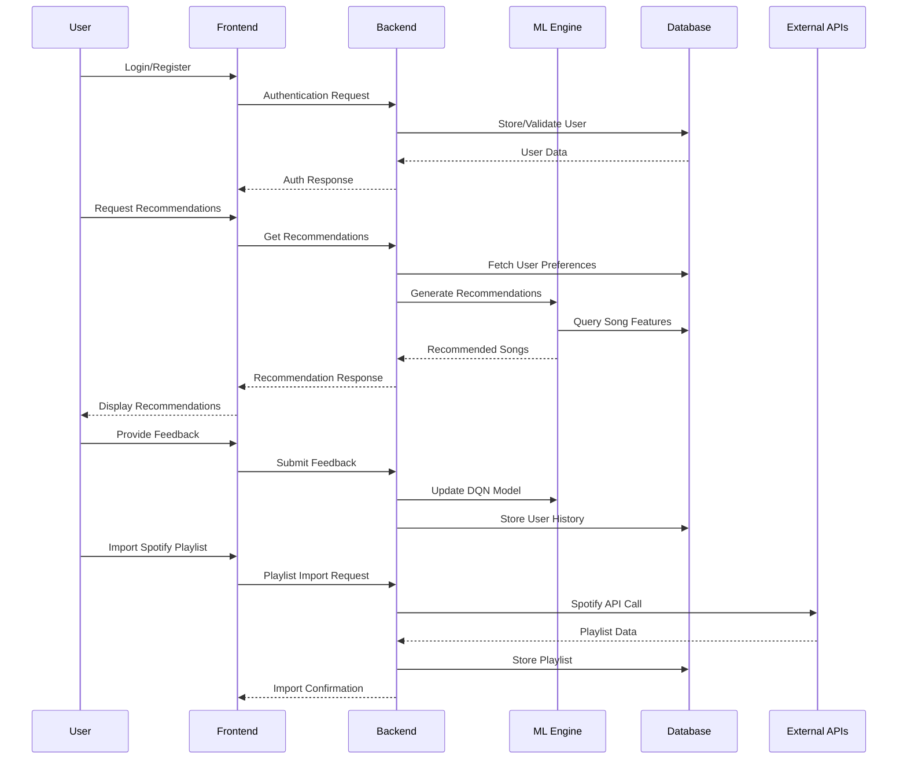
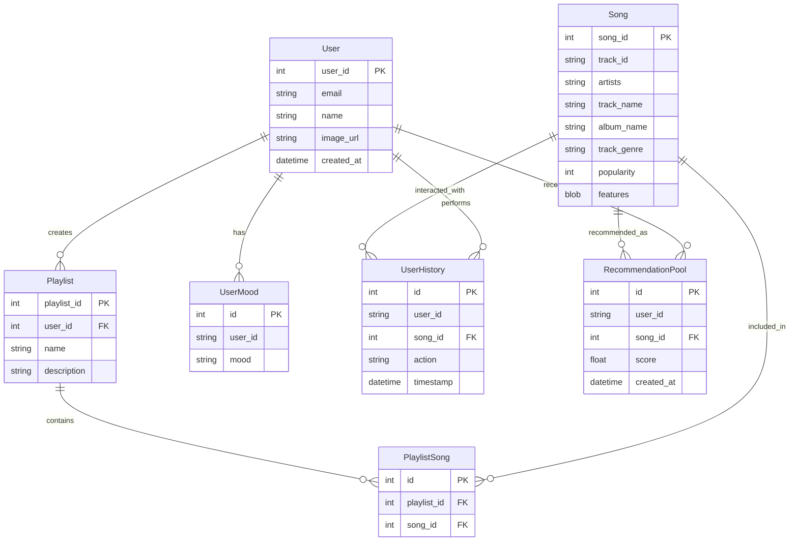

# AMANO - Intelligent Music Recommendation System

<div align="center">


*Discover music tailored to your mood and preferences with AI-powered recommendations*

[](https://nextjs.org/)
[](https://reactjs.org/)
[](https://flask.palletsprojects.com/)
[](https://python.org/)
[](https://sqlite.org/)

</div>

## 🎵 Overview

AMANO is a sophisticated music recommendation system that combines machine learning, deep reinforcement learning, and natural language processing to deliver personalized music experiences. The system analyzes user preferences, mood patterns, and audio features to create intelligent playlists that evolve with user feedback.

### Key Features

- 🧠 **AI-Powered Recommendations** - Deep Q-Network (DQN) reinforcement learning
- 🎭 **Mood Detection** - Natural language processing with AWS Bedrock LLM
- 🎨 **Beautiful UI** - Modern React interface with animated components
- 🎶 **Spotify Integration** - Seamless playlist import and management
- 📊 **Audio Analysis** - Advanced feature extraction (energy, valence, tempo, etc.)
- 👤 **User Personalization** - Learning from user interactions and feedback
- 📱 **Responsive Design** - Works across all devices

## 🏗️ System Architecture

### High-Level Architecture



### Component Architecture



### Data Flow Architecture



## 🛠️ Tech Stack

### Frontend Stack
| Technology | Version | Purpose |
|------------|---------|---------|
| **Next.js** | 15.1.6 | React framework with SSR/SSG |
| **React** | 19.0.0 | UI library |
| **TailwindCSS** | 3.4.17 | Utility-first CSS framework |
| **Motion** | 12.0.6 | Animation library |
| **FontAwesome** | 6.7.2 | Icon library |

### Backend Stack
| Technology | Version | Purpose |
|------------|---------|---------|
| **Flask** | Latest | Python web framework |
| **SQLAlchemy** | Latest | ORM for database operations |
| **Flask-CORS** | Latest | Cross-origin resource sharing |
| **PyTorch** | Latest | Deep learning framework |
| **scikit-learn** | Latest | Machine learning library |
| **pandas** | Latest | Data manipulation |

### AI/ML Stack
| Technology | Purpose |
|------------|---------|
| **PyTorch** | Deep Q-Network implementation |
| **scikit-learn** | Clustering, similarity calculations |
| **VADER Sentiment** | Sentiment analysis |
| **AWS Bedrock** | Large Language Model integration |
| **LangChain** | LLM orchestration |

### Database & Storage
| Technology | Purpose |
|------------|---------|
| **SQLite** | Primary database |
| **CSV Files** | Spotify dataset storage |
| **Binary Serialization** | Audio feature storage |

## 📊 Database Schema



## 🚀 Getting Started

### Prerequisites

- **Node.js** (v18 or higher)
- **Python** (v3.8 or higher)
- **npm** or **yarn**
- **Git**

### Installation

1. **Clone the repository**
   ```bash
   git clone https://github.com/sbeeredd04/Amano.git
   cd Amano
   ```

2. **Setup Backend**
   ```bash
   # Install Python dependencies
   pip install -r requirements.txt
   
   # Initialize database and load dataset
   cd server
   python app.py
   ```

3. **Setup Frontend**
   ```bash
   # Navigate to frontend directory
   cd amano-next
   
   # Install Node.js dependencies
   npm install
   
   # Start development server
   npm run dev
   ```

4. **Environment Configuration**
   ```bash
   # Create .env file in server directory
   touch server/.env
   
   # Add required environment variables
   echo "AWS_ACCESS_KEY_ID=your_aws_key" >> server/.env
   echo "AWS_SECRET_ACCESS_KEY=your_aws_secret" >> server/.env
   echo "SPOTIFY_CLIENT_ID=your_spotify_id" >> server/.env
   echo "SPOTIFY_CLIENT_SECRET=your_spotify_secret" >> server/.env
   ```

### Quick Start

1. **Start the backend server:**
   ```bash
   cd server
   python app.py
   ```
   Server runs on `http://localhost:5000`

2. **Start the frontend development server:**
   ```bash
   cd amano-next
   npm run dev
   ```
   Application runs on `http://localhost:3000`

3. **Access the application:**
   - Open `http://localhost:3000` in your browser
   - Create an account or login
   - Start discovering music!

## 🎯 API Documentation

### Authentication Endpoints

| Method | Endpoint | Description |
|--------|----------|-------------|
| POST | `/auth/signup` | Register new user |
| POST | `/auth/login` | User login |

### Recommendation Endpoints

| Method | Endpoint | Description |
|--------|----------|-------------|
| POST | `/recommendation/recs` | Generate recommendations |
| GET/POST | `/recommendation/mood` | Get/update user mood |
| POST | `/recommendation/feedback` | Submit song feedback |
| POST | `/recommendation/refresh` | Refresh recommendation pool |
| POST | `/recommendation/visualize` | Generate cluster visualization |

### Playlist Endpoints

| Method | Endpoint | Description |
|--------|----------|-------------|
| GET/POST | `/playlists/get` | Retrieve user playlists |
| POST | `/playlists/create` | Create new playlist |
| POST | `/playlists/add_song` | Add song to playlist |
| GET | `/playlists/songs` | Get songs with filtering |
| POST | `/playlists/user_songs` | Get user's playlist songs |

### Chatbot Endpoints

| Method | Endpoint | Description |
|--------|----------|-------------|
| POST | `/chatbot/chat` | Interact with mood detection chatbot |

## 🧠 Machine Learning Components

### Deep Q-Network (DQN) Agent

The recommendation system uses a Deep Q-Network for reinforcement learning:

```python
class DQN(nn.Module):
    def __init__(self, state_size, action_size):
        super(DQN, self).__init__()
        self.fc1 = nn.Linear(state_size, 128)
        self.fc2 = nn.Linear(128, 128)
        self.fc3 = nn.Linear(128, action_size)
```

**Features:**
- State representation: User preferences and song features
- Action space: Song recommendations
- Reward system: User feedback (likes/dislikes)
- Experience replay for stable learning

### Audio Feature Analysis

The system analyzes songs using these audio features:

| Feature | Weight | Description |
|---------|---------|-------------|
| **Energy** | 5.0 | Perceptual measure of intensity |
| **Acousticness** | 5.0 | Acoustic vs electric instrumentation |
| **Valence** | 5.0 | Musical positivity/negativity |
| **Tempo** | 5.0 | Beats per minute |
| **Instrumentalness** | 5.0 | Vocal vs instrumental content |
| **Speechiness** | 5.0 | Presence of spoken words |
| **Popularity** | 1.0 | Track popularity score |

### Mood Detection

Integrated LLM service for natural language mood analysis:

**Supported Moods:** Angry, Content, Happy, Delighted, Calm, Sleepy, Sad, Depressed, Excited

## 🎨 UI Components

The frontend features custom React components:

### Vortex Background
- Animated particle system
- Customizable particle count and behavior
- Smooth performance with canvas optimization

### Expandable Playlist
- Interactive playlist viewer
- Song details with audio features
- Like/dislike functionality
- Playlist management controls

### Navigation Menu
- Responsive navigation
- User authentication state
- Smooth animations

## 📈 Performance & Scalability

### Optimization Features

- **Database Optimization:** Indexed queries and connection pooling
- **Frontend Performance:** Next.js SSR/SSG and image optimization
- **ML Model Efficiency:** Feature caching and batch processing
- **API Rate Limiting:** Spotify API request management

### Scalability Considerations

- **Horizontal Scaling:** Stateless backend design
- **Caching Layer:** Redis integration ready
- **Database Migration:** PostgreSQL migration path
- **CDN Integration:** Static asset optimization

## 🔧 Configuration

### Backend Configuration

Key configuration files:
- `server/app.py` - Flask application setup
- `server/utils/db.py` - Database configuration
- `requirements.txt` - Python dependencies

### Frontend Configuration

Key configuration files:
- `amano-next/next.config.mjs` - Next.js configuration
- `amano-next/tailwind.config.js` - TailwindCSS setup
- `amano-next/package.json` - Node.js dependencies

## 🚀 Deployment

### Production Deployment

1. **Backend Deployment (Flask):**
   ```bash
   # Using Gunicorn
   gunicorn -w 4 -b 0.0.0.0:5000 app:app
   ```

2. **Frontend Deployment (Vercel):**
   ```bash
   # Build and deploy
   npm run build
   vercel --prod
   ```

3. **Database Migration:**
   ```bash
   # For production database
   python -c "from utils.db import init_db; init_db()"
   ```

### Environment Variables

Required for production:
```env
# AWS Configuration
AWS_ACCESS_KEY_ID=your_aws_access_key
AWS_SECRET_ACCESS_KEY=your_aws_secret_key
AWS_REGION=us-west-2

# Spotify API
SPOTIFY_CLIENT_ID=your_spotify_client_id
SPOTIFY_CLIENT_SECRET=your_spotify_client_secret

# Database
DATABASE_URL=sqlite:///production.db

# Frontend API URL
NEXT_PUBLIC_API_URL=https://your-api-domain.com
```

## 🤝 Contributing

We welcome contributions! Please see our contributing guidelines:

1. Fork the repository
2. Create a feature branch
3. Make your changes
4. Add tests if applicable
5. Submit a pull request

### Development Workflow

```bash
# Create feature branch
git checkout -b feature/new-feature

# Make changes and test
npm run test
python -m pytest

# Commit and push
git commit -m "Add new feature"
git push origin feature/new-feature
```

## 📝 License

This project is licensed under the MIT License - see the [LICENSE](LICENSE) file for details.

## 🙏 Acknowledgments

- **Spotify Web API** for music data
- **AWS Bedrock** for LLM services
- **Next.js** and **React** communities
- **scikit-learn** and **PyTorch** for ML frameworks
- **TailwindCSS** for beautiful styling

---

<div align="center">

**Built with ❤️ by the Amano Team**

[Report Bug](https://github.com/sbeeredd04/Amano/issues) · [Request Feature](https://github.com/sbeeredd04/Amano/issues) · [Documentation](https://github.com/sbeeredd04/Amano/wiki)

</div>